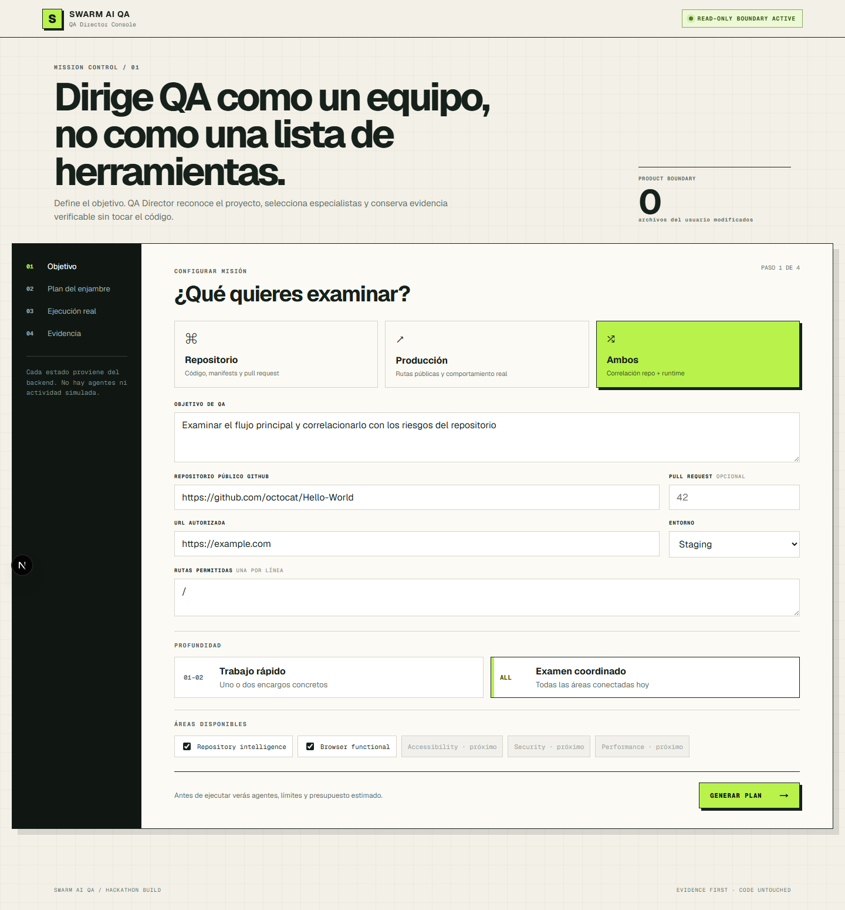
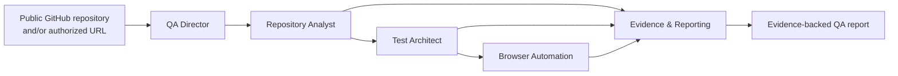

# Swarm AI QA

**An autonomous, evidence-first QA department that never modifies the evaluated code.**

Swarm AI QA coordinates specialized agents to inspect GitHub repositories, recognize project
stacks and monorepos, execute bounded browser journeys against authorized applications, correlate
repository and runtime evidence, and publish an explainable QA report.

> Hackathon MVP — real agents, real Playwright execution, real event streaming, zero source-code
> writes.



## Why this project exists

Traditional QA tools usually produce isolated scanner outputs. Swarm AI QA models the workflow of
a real quality-engineering team:

1. **QA Director** interprets the mission and creates a deterministic execution plan.
2. **Repository Analyst** detects components, languages, frameworks and pull-request impact.
3. **Test Architect** converts evidence and risk into approved runtime journeys.
4. **Browser Automation Engineer** executes bounded Playwright navigation.
5. **Evidence & Reporting Analyst** correlates outputs without inventing findings or causality.



## Permanent read-only boundary

Agents may inspect, navigate, observe, capture evidence and report. They never:

- edit source files;
- generate patches or replacement code;
- create branches or pull requests;
- commit to the evaluated repository;
- run discovered project commands without separate authorization.

Runtime targets are protected by same-origin navigation, route allowlists, request budgets,
`GET/HEAD` enforcement, and blocking of localhost, private, link-local, reserved and metadata
addresses.

## Working capabilities

- FastAPI control plane with plan preview, approval, cancellation, durable checkpoints and SSE.
- Public GitHub repository and optional pull-request inspection using bounded REST `GET` requests.
- Canonical repository validation and explicit private-repository server allowlist.
- Language and framework recognition from repository trees and captured manifests.
- Monorepo component separation with correct working directories.
- Pull-request impact grouped by affected component.
- Conservative Next.js route candidates derived from verifiable file conventions.
- Playwright Chromium journeys with screenshots, traces, console errors and network observations.
- Real axe-core WCAG A/AA scans with redacted JSON evidence and explicit manual coverage gaps.
- Browser + accessibility correlation by the exact allowlisted runtime URL.
- Repository + runtime evidence correlation without unsupported causal claims.
- Next.js QA Director UI with real planning, execution status, event streaming and reports.
- Automatic Neon persistence when `DATABASE_URL` exists, with SQLite fallback for local work.
- Startup validation for the Neon connection and required run tables.

## Stack

- **Control plane:** Python, FastAPI, Pydantic
- **Orchestration:** asynchronous dependency graph, retries, cancellation and event stream
- **Repository intelligence:** GitHub REST API, read-only
- **Runtime QA:** Playwright + Chromium + axe-core
- **Frontend:** Next.js App Router, React, TypeScript
- **Persistence:** automatic Neon PostgreSQL selection with local SQLite fallback

## Quick start

Requirements:

- Python 3.11+
- Node.js 20.9+
- PowerShell, Bash or an equivalent terminal

### 1. Install backend dependencies

```powershell
python -m venv .venv
.\.venv\Scripts\Activate.ps1
python -m pip install --upgrade pip
python -m pip install -r requirements-dev.txt
python -m playwright install chromium
```

On Bash, activate the environment with `source .venv/bin/activate`.

### 2. Start the control plane

```powershell
python -m uvicorn api.automation_factory:create_automation_app --factory --reload
```

FastAPI and OpenAPI will be available at:

- `http://127.0.0.1:8000/healthz`
- `http://127.0.0.1:8000/docs`

### 3. Start QA Director

In another terminal:

```powershell
cd frontend
npm install
npm run dev
```

Open `http://localhost:3000`.

The frontend proxies `/control-plane/*` to FastAPI through the server-side
`SWARM_CONTROL_PLANE_URL` setting. When API authentication is enabled, the server-side proxy
injects `SWARM_CONTROL_PLANE_API_KEY`; secrets must never use the `NEXT_PUBLIC_` prefix.

## Environment configuration

Copy `.env.example` to `.env` only when credentials are required. Never commit `.env`.

Important variables:

| Variable | Purpose |
|---|---|
| `DATABASE_URL` | Pooled Neon application connection |
| `DATABASE_DIRECT_URL` | Direct Neon connection for migrations |
| `SWARM_STORAGE_BACKEND` | `auto`, `neon` or `sqlite` store selection |
| `SWARM_API_KEY` | Optional Bearer key protecting every `/v1` route |
| `GITHUB_TOKEN` | Read-only access for explicitly allowlisted private repositories |
| `SWARM_GITHUB_ALLOWED_PRIVATE_REPOSITORIES` | Canonical private repository IDs |
| `SWARM_SQLITE_PATH` | Local checkpoint database |
| `SWARM_ARTIFACT_ROOT` | Local screenshots and Playwright traces |
| `SWARM_AXE_SCRIPT_PATH` | Optional override for the installed axe-core script |

Public repositories are intentionally inspected without the server's private GitHub token.

## Verification

```powershell
python -m unittest discover -s tests -v
```

Current result:

```text
Ran 61 tests
OK
```

Frontend verification:

```powershell
cd frontend
npm audit
npm run build
```

The current dependency audit reports zero known vulnerabilities.

## Repository map

```text
agents/        Agent profiles and permanent read-only policies
adapters/      External read-only adapters
api/           FastAPI control plane
database/      SQLAlchemy schema and Alembic migration
executors/     Real agent executors
frontend/      QA Director Next.js application
orchestrator/  Planning, scheduling, state and events
schemas/       Strict cross-agent contracts
tests/         Contract, integration and real Chromium tests
workers/       Bounded tool workers
```

## Current limitations

- Bearer authentication is single-tenant; user accounts and role-based access are not implemented.
- Browser automation is navigation-only: no login, clicks or form submission yet.
- Screenshots and traces must not contain real sensitive user data.
- Security and performance agents are visible as pending and never simulated.
- axe-core detects only automatable issues; keyboard, screen-reader and full WCAG conformance
  remain explicitly unverified.
- Active tasks are not resumed automatically after a process restart.

## Documentation

- [Product requirements](Swarm_AI_QA_PRD_v1.0.md)
- [Execution kernel ADR](docs/adr/ADR-011-orchestration-execution-kernel.md)
- [Permanent read-only boundary ADR](docs/adr/ADR-012-read-only-qa-product-boundary.md)
- [Project continuity](CONTINUIDAD_PROYECTO.md)
